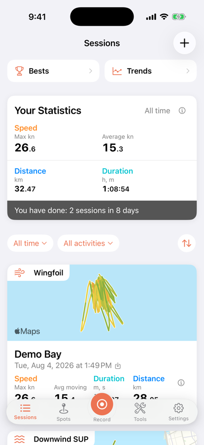
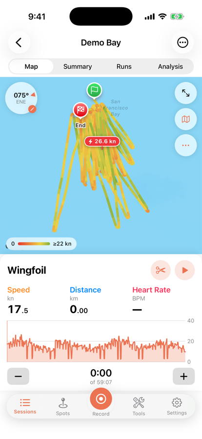
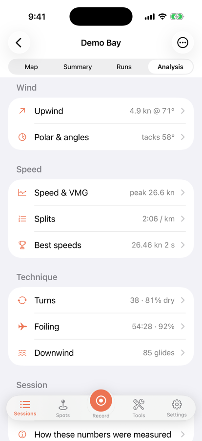
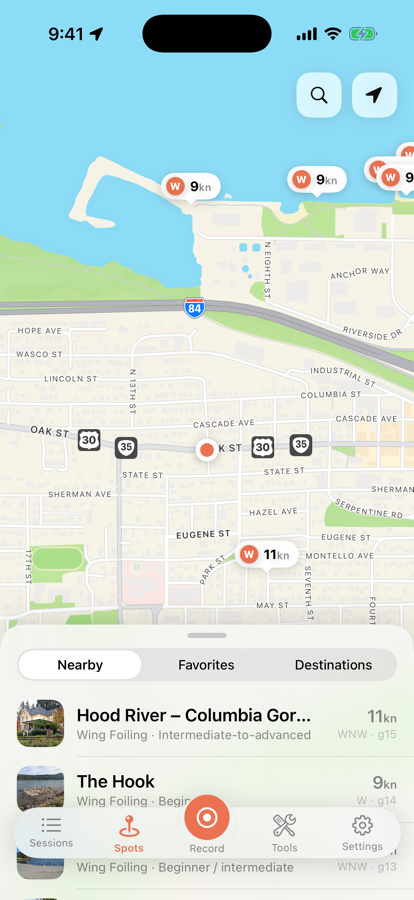
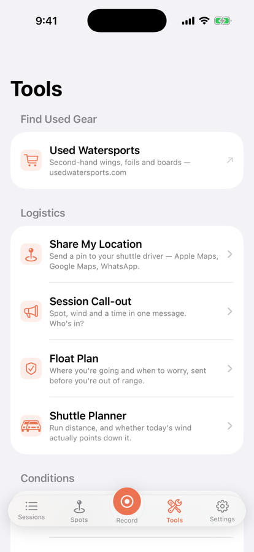
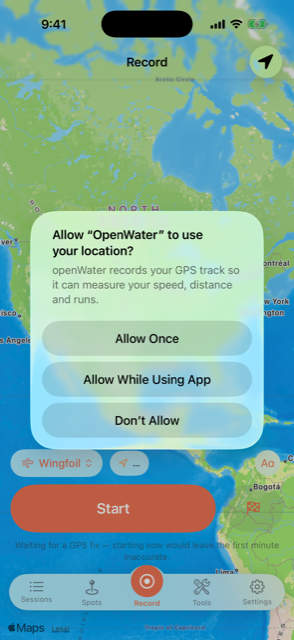

# openWater

An open-source session tracker for wind-powered watersports — wingfoiling,
parawinging, downwinding, windsurfing, kiting, SUP and sailing. iPhone, Apple
Watch and Apple TV, no account, no subscription, every feature free.

**[openwaterapp.com](https://openwaterapp.com)** · [Spot guide](https://openwaterapp.com/spots)

| | | |
|:--:|:--:|:--:|
|  |  |  |
| **Sessions** — every session with its track, distance and best speeds | **Map** — speed-coloured track, editable wind, trim and replay | **Analysis** — one row per topic, each with its headline |
|  |  |  |
| **Spots** — 1000+ launches with live wind on the pins | **Tools** — share a pin, call out a session, plan a shuttle | **Record** — start knowing the wind at your launch |

## What it does

- **Speed categories** riders actually compare: 2 s, 10 s, 5×10 s, 100 m, 250 m,
  500 m, 1 NM, 1 h, and Alpha 500/1000 to the community rule.
- **Foiling analysis** — flights, time on foil, dry-gybe rate, touchdowns.
- **Upwind and VMG** — per-tack angles, best beat, and every upwind leg drawn on
  the map with the angle it was sailed at.
- **Downwind** — glide detection, bump period, and a shuttle planner that says
  how far off dead downwind today's wind puts your run.
- **A spot guide** — the same published database the website serves, with live
  model wind, cached for offline, and a camera-first way to fix a spot from the
  beach.
- **Your data stays yours** — no account, no server of ours, complete exports in
  a documented format, and sharing only when you tap share.

```
openWater/
├── OpenWaterCore/            Swift package: model, analysis, ingest, IO.
│                             Platform-free and fully tested — this is where
│                             every number the app shows is computed.
├── OpenWaterSpots/           Swift package: the guide, the weather clients and
│                             the wind field. Shared by the phone and the TV.
├── openWater/                iOS app
├── openWater Watch App/      watchOS app (records standalone)
├── openWater TV/             tvOS app (favourites, wind map, cameras)
├── openWaterTests/           iOS unit tests
├── openWaterUITests/         UI + screenshot tests
├── Marketing/                App Store screenshots and metadata
├── docs/screenshots/         The shots used in this README
├── scripts/testflight.sh     Archive and upload to TestFlight
└── docs/PLAN.md              Design notes
```

The analysis lives in `OpenWaterCore` rather than in either app on purpose: a
session recorded on a wrist and one recorded on a phone go through identical
filtering, identical window maths and identical detection, so personal bests are
comparable across whichever device was to hand. `OpenWaterSpots` is the same
argument for the weather: the phone and the television ask the same clients the
same questions and colour the answers with the same ramp, so a green afternoon
means one thing in the house and the same thing on the beach.

The Apple TV app is deliberately three screens — a wind map of the coast
you're on, the cameras in that area, and your starred spots. It records
nothing. The map finds the box's own coarse location or asks you to name a
place, and the remote drives it: the D-pad pans, Select and Play/Pause zoom.
Every camera is listed, and since tvOS has no web view, the ones it cannot
play — mostly YouTube — show a QR code that opens the page on your phone.

## Building

Requires Xcode 16 or newer.

```bash
open openWater.xcodeproj
```

Run the core tests from the command line — they are fast and they cover the
parts that matter:

```bash
cd OpenWaterCore && swift test
```

Building the `openWater` scheme also builds and embeds the watch app.

---

## Shipping a TestFlight build

`scripts/testflight.sh` archives, verifies and uploads in one non-interactive
command. Non-interactive is the whole point: an upload that stops to ask for an
Apple ID password is one that cannot be run for you, from a chat window or from
CI. Authentication is an App Store Connect API key — a file on this machine plus
two identifiers — and the key is never passed on the command line, where it
would land in shell history and in the process list.

### One-time setup

**1. Create an App Store Connect API key.**

Go to [App Store Connect → Users and Access → Integrations → App Store Connect
API](https://appstoreconnect.apple.com/access/integrations/api), pick **Team
Keys**, and generate a key with the **App Manager** role.

Role matters and the error message when it is wrong does not say so. *Developer*
cannot upload builds at all. *Admin* works but grants far more than uploading
needs — App Manager is the smallest role that can do the job.

**2. Download the key.**

Apple lets you download the `.p8` exactly once. If it is lost, the key cannot be
recovered — revoke it and generate a new one.

**3. Put it where the tools look for it.**

```bash
mkdir -p ~/.appstoreconnect/private_keys
mv ~/Downloads/AuthKey_*.p8 ~/.appstoreconnect/private_keys/
```

**4. Save the two identifiers next to it.**

Both are on the same App Store Connect page: the Key ID is in the key's row, the
Issuer ID is above the table and is shared by every key on the team.

```bash
printf 'ASC_KEY_ID=XXXXXXXXXX\nASC_ISSUER_ID=aaaaaaaa-bbbb-cccc-dddd-eeeeeeeeeeee\n' > ~/.appstoreconnect/openwater.env
```

Nothing here is in the repository, and nothing here should be: `~/.appstoreconnect`
is outside the working tree so a stray `git add -A` cannot commit a signing key.

### Uploading

```bash
scripts/testflight.sh
```

That bumps the build number, archives, verifies the built product, and uploads.
Processing on Apple's side takes a few minutes before the build appears in
TestFlight. To re-upload a specific build number instead of taking the next one:

```bash
scripts/testflight.sh 12
```

### What the script checks before uploading

It inspects the **built product**, not the source, because the two have
disagreed in ways that cost a full upload cycle each time:

- **Location and motion usage strings.** Missing ones do not fail the build;
  iOS terminates the app the moment it asks for location. A shipped build did
  exactly this.
- **`UIBackgroundModes: location` on the phone app.** Xcode silently drops this
  when it is supplied as an `INFOPLIST_KEY_*` build setting, which is why it
  lives in `Info-iOS.plist` instead.
- **`WKBackgroundModes: workout-processing` on the watch app** — and that
  `workout-processing` is *not* in the watch's `UIBackgroundModes`, which App
  Store validation rejects.
- **Matching build numbers** between the watch app and the phone app. A mismatch
  is rejected at upload with a message that never mentions build numbers.

If any of these fail the script stops before spending an upload.

### When it fails

| Symptom | Cause |
| --- | --- |
| `Missing ASC_KEY_ID` | `~/.appstoreconnect/openwater.env` is absent or misspelled |
| `No API key at ~/.appstoreconnect/private_keys/AuthKey_….p8` | Filename must match the Key ID exactly |
| `403` / `not authorized` during upload | Key has the Developer role — regenerate as App Manager |
| Signing or provisioning errors | The script passes `-allowProvisioningUpdates`; the Apple ID still has to be in the team. Forks: set `OPENWATER_TEAM_ID` to your own |

---

## Turning on WeatherKit

WeatherKit is **not currently used for the live wind** — the Record tab and the
spot guide read Open-Meteo, which needs no entitlement and works today. What
WeatherKit still offers is **Use recorded conditions** on a saved session: the
wind that was actually blowing, from Apple's historical hourly data. That
matters more than it sounds — otherwise a session's wind direction is guessed
from the shape of the track (or set by hand on the dial), and every angle, VMG
figure and polar is measured from that.

The code side is done, and `Settings → Weather` runs a live check that prints
the verbatim error if the service refuses. The account side needs your Apple ID and has to be done
once:

1. Go to [Certificates, Identifiers & Profiles →
   Identifiers](https://developer.apple.com/account/resources/identifiers/list),
   open **com.laan.labs.openWater**, tick **WeatherKit**, and save.
2. In Xcode, let it refresh the provisioning profile (Signing & Capabilities
   will offer to). `scripts/testflight.sh` passes `-allowProvisioningUpdates`,
   so an archive picks the new profile up on its own.

`openWater/openWater.entitlements` already declares
`com.apple.developer.weatherkit`, and the target points at it.

**Until step 1 is done, every WeatherKit call fails.** That is handled rather
than fatal: the conditions strip hides itself, "Use recorded conditions" says
so plainly, and the session keeps its estimated wind. Nothing else in the app
touches the network.

### When it fails

**Settings → Weather** runs a check on its own and prints the error verbatim.
Use it before changing anything — the failures look identical from the Record
tab, which shows nothing at all in every one of them.

`WeatherDaemon.WDSJWTAuthenticatorServiceListener.Errors Code=2` is the service
refusing the app's token. It is *not* a missing entitlement, and as of
2026-08-03 it is what both the simulator and a real iPhone 17 Pro return here
while everything checkable on our side is correct:

- the App ID carries the capability — a profile cannot contain an entitlement
  the App ID does not have, and both `com.laan.labs.openWater` profiles do:

  ```
  security cms -D -i "$APP/embedded.mobileprovision" | grep weatherkit
  ```

- the device build is signed with it (`codesign -d --entitlements - "$APP"`)
- the simulator build has it too, in `openWater.app-Simulated.xcent` rather
  than `openWater.app.xcent` — the latter is empty for every simulator build
  and is not a symptom of anything

That leaves Apple's side. Enabling the capability registers the App ID with the
weather service and the registration is not instant; Apple says up to thirty
minutes, and longer is common. If it persists for more than a day, confirm in
the portal that WeatherKit is actually ticked for the App ID — Xcode can enable
it silently during an `-allowProvisioningUpdates` build, and a build that
succeeded is not evidence the portal agrees.

Note that a build succeeding proves nothing about WeatherKit. The entitlement
is compile-time and the token exchange happens at the first call, on device, at
runtime.

Worth knowing:

- **A paid Apple Developer account is required.** WeatherKit is not available
  on a free one.
- **500,000 calls a month are included**, then it is billed per call. Each
  session asks once and the answer is stored with it, so a library of a
  thousand sessions costs a thousand calls, not a thousand per launch.
- **Attribution is mandatory.** The  Weather mark and a link to Apple's legal
  page must appear wherever the data is shown. Both are in place; if you move
  that data to a new screen, they have to go with it.
- **It is a model on a roughly 2 km grid, not an anemometer on the beach.** In a
  gorge or a bay it can be well off what the rider felt, which is why the app
  offers the figure for them to accept rather than applying it silently.

---

## Getting the watch app onto a real Apple Watch

Xcode installs the watch app *through* the phone, and it is quietly strict about
the conditions. In order:

1. **Developer Mode on the watch**, which is separate from the one on the phone:
   Watch → Settings → Privacy & Security → Developer Mode → on, then let it
   restart. Until this is on, the watch does not appear in `xcrun devicectl list
   devices` at all and Xcode behaves as though it is not paired.
2. Watch unlocked and on the wrist, phone unlocked, both on the same Wi-Fi.
3. Build the **openWater** scheme to the *phone*. The watch app is embedded and
   installs alongside it — do not run the watch scheme directly for a first
   install.
4. Give it a couple of minutes. The first install is pushed over Bluetooth and
   is genuinely slow; watchOS also declines to install while the watch is below
   ~50% battery and not charging.
5. If it still does not appear, check the watch's own App Store → Account →
   Installed Apps for a stalled entry and delete it before retrying.

## Configuration and keys

There is one credential-shaped string in this repository — the Firebase Web API
key in `openWater/Spots/SpotGuideStore.swift` — and it is deliberately in the
open. Firebase Web keys are project *identifiers*, not secrets: they cannot
grant access on their own, they ship inside any client that talks to Firebase,
and this one is already served to every browser that loads
[openwaterapp.com](https://openwaterapp.com). Hiding it would break
`git clone && build` and buy nothing.

What actually protects the data is the rules, which are worth reading if you are
reviewing this:

- **Firestore** — spots are readable only when `status == "published"` and
  `isTest == false`, so a query that does not filter on both is denied outright.
  `spotSuggestions` is *create-only* with every field length-bounded; the app
  cannot read, list, edit or delete a suggestion, including its own.
- **Storage** — shares and suggestion photos are create-only and write-once, so
  a link already in somebody's hands can never be swapped for different content.
  Suggestion photos are not publicly readable at all; they are reviewed with
  owner credentials before anything ships.

The known gap, documented rather than hidden: nothing stops an unauthenticated
client writing junk in a loop. There is no per-caller quota available in rules —
App Check is the fix if it ever happens in practice.

To build a fork against your own Apple team, set `OPENWATER_TEAM_ID` rather than
editing `scripts/testflight.sh`.

## Licence

MIT — see [LICENSE](LICENSE). Use it, fork it, ship it; keep the notice.
